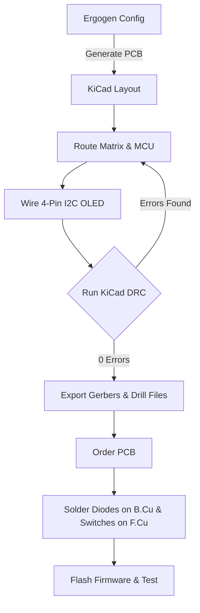

# solemn-v1.1

```mermaid
flowchart TD
    A[Ergogen Config] -->|Generate PCB| B[KiCad Layout]
    B --> C[Route Matrix & MCU]
    C --> D[Wire 4-Pin I2C OLED]
    D --> E{Run KiCad DRC}
    E -->|Errors Found| C
    E -->|0 Errors| F[Export Gerbers & Drill Files]
    F --> G[Order PCB]
    G --> H[Solder Diodes on B.Cu & Switches on F.Cu]
    H --> I[Flash Firmware & Test]
```
